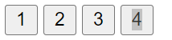

For homework, create a html page with a single button in it. Add an event listener so that when this button is clicked, a new button is created and added to the page. When this new button is clicked, it should also add a new button, and so on for each button created. 
The text for each button should be an incrementing number so you should see something like below after clicking 3 times (1 is there at start)

(E.C. do this is 2 ways, first by having a separate event listener on every button, then second by having a single event listener on the "parent")

To create a button from JavaScript you can use document.createElement  e.g. const myNewButton = document.createElement('button') will create a button element - that is not yet part of the html in the page. You can add it to a particular existing element in the page using appendChild, e.g. document.body.appendChild(myNewButton) will add myNewButton to the end of the body element of the page. You can of course add event listeners to this button just as you can add event listeners to buttons that were created in the HTML the normal way as well as set its innerText or innerHTML...

Of course you should not be creating any globals (IIFE) and in general be linting your code with reasonable settings to ensure quality code.