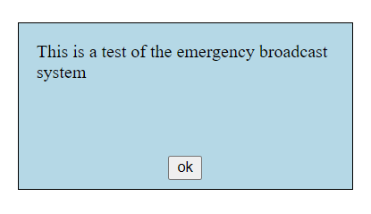

For hw, look at how we made the contact form "popup window" and use that approach to make a general purpose message box. In other words, you should be able to do something like:
messageBox.show('This is a test of the emergency broadcast system'); 
and a message box will popup, maybe looking something like this;

Clicking ok, dismisses the message box.
For fun, add an input and a button to your page, user can type something into the input, click the button, and a message box with the entered text shows up...

(E.C. why not use the module pattern we've been looking at and make this available as app.messageBox.show or something similar rather then either not available to others at all or available as a simple global function)

Also if you didn't yet do the extra part of the last homework (add colors to table and then when clicked use those colors) feel free to do that as well.