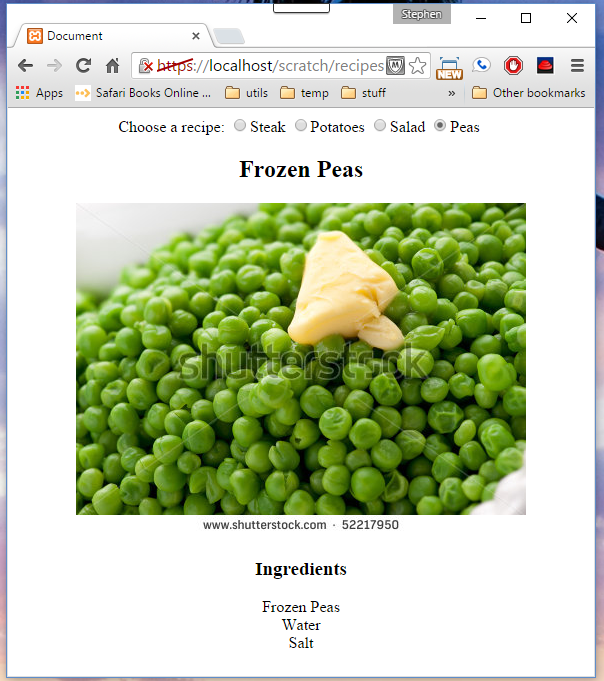

For homework please do the following exercise where we will use Ajax in a more realistic way to actually do something useful. Continue to use jQuery for DOM manipulation.

*    Create a HTML page that displays recipes. The page should allow the user to pick from a list of available recipes (the selection of recipe could be by radio buttons, regular buttons, a select drop down, make them type the correct name into a text box, whatever you like). use AJAX to fetch a JSON list of available recipes (which includes name of each recipe and perhaps the url to fetch the actual recipe from - if name is not enough. If you aren't sure how to write the JSON - create what you want in JavaScript  and then use JSON.stringify() to output it as JSON and capture the string)
*    When user makes a selection (on change or click whatever makes sense given your UI choice) fetch the selected recipe from the server and display it (of course using Ajax, not a full page reload)
*    For now the list of recipes and each recipe will be stored in separate JSON files as we did for the contacts example but realistically each would be dynamically created on demand by the server (by getting requested data from a db and returning as JSON). The JavaScript wouldn't change. Again in a more real example we could have millions of recipes in different categories etc so we cant load all the recipes at once. Instead the user would filter through various filters, make a selection and we would fetch just that one when selected.

	You should only see one recipe at a time. When a new one is loaded, old one should be replaced in html. You can either blow away all the old html and replace it completely (.remove), or just reuse the existing elements by emptying them (.empty) and/or changing them as needed. whatever you find easier..

    Each recipe should have a name, ingredients (an array) and a picture (a url).

For example your page might look something like this:
